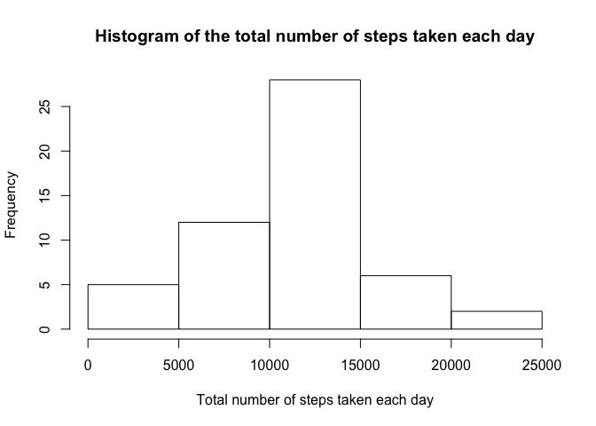
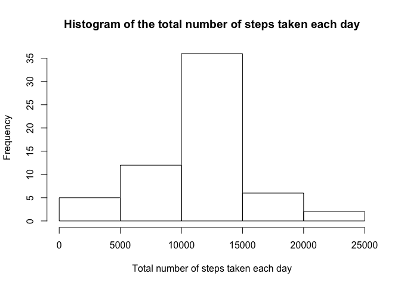

# Reproducible Research: Peer Assessment 1


## Loading and preprocessing the data

1. Load the data (i.e. 𝚛𝚎𝚊𝚍.𝚌𝚜𝚟())
2. Process the data by coverting the format of "date" variable to date format


```r
activity <- read.csv("/Users/gongmengyan/Google Drive/Data Science/Data Science Specialization/5. Reproducible Research/Assignment/activity.csv")
activity$date <- as.POSIXct(as.character(activity$date),format="%Y-%m-%d")
```

## What is mean total number of steps taken per day?

1. Calculate the total number of steps taken per day
2. Make a histogram of the total number of steps taken each day
3. Calculate and report the mean and median of the total number of steps taken per day  


```r
total <- aggregate(steps~date,data=activity, FUN =sum)
hist(total$steps,main="Histogram of the total number of steps taken each day",xlab="Total number of steps taken each day")
```

 

```r
mean(total$steps)
```

```
## [1] 10766.19
```

```r
median(total$steps)
```

```
## [1] 10765
```

## What is the average daily activity pattern?

1. Make a time series plot (i.e. type = "l") of the 5-minute interval (x-axis) and the average number of steps taken, averaged across all days (y-axis)  
2. Which 5-minute interval, on average across all the days in the dataset, contains the maximum number of steps?


```r
average <- aggregate(steps~interval,data=activity, FUN =mean)
plot(average$interval,average$steps,type="l",xlab = "Interval",ylab = "Number of steps")
```

 

```r
max(average$interval)
```

```
## [1] 2355
```

## Imputing missing values

1. Calculate and report the total number of missing values in the dataset (i.e. the total number of rows with 𝙽𝙰s)
2. Create a new dataset that is equal to the original dataset but with the missing data filled in by the mean for that 5-minute interval
3. Make a histogram of the total number of steps taken each day
4. Calculate and report the mean and median total number of steps taken per day. 


```r
sum(is.na(activity$steps))
```

```
## [1] 2304
```

```r
fillin <- function(x) {
for (i in 1:length(x[,1])) 
        {
        if (is.na(x[i,1]))
                y=subset(x[,1],x[,3]==x[i,3])
                x[i,1]=mean(y[!is.na(y)])
        }
return(x) }
activitynew <- fillin(activity)
totalnew <- aggregate(steps~date,data=activitynew, FUN =sum)
hist(totalnew$steps,main="Histogram of the total number of steps taken each day",xlab="Total number of steps taken each day")
```

 

```r
mean(totalnew$steps)
```

```
## [1] 961.0251
```

```r
median(totalnew$steps)
```

```
## [1] 344.1509
```

## Are there differences in activity patterns between weekdays and weekends?

1. Create a new factor variable in the dataset with two levels – “weekday” and “weekend” indicating whether a given date is a weekday or weekend day.  
2. Make a panel plot containing a time series plot (i.e. type = "l") of the 5-minute interval (x-axis) and the average number of steps taken, averaged across all weekday days or weekend days (y-axis). 


```r
library(chron)
activitynew$weekfactor<-as.factor(ifelse(is.weekend(activitynew[,2]),"weekend","weekday"))
averagenew<-aggregate(steps~interval+weekfactor,
                      data=activitynew, FUN =mean)
library(lattice)
xyplot(steps~interval|weekfactor,data=averagenew,layout=c(1,2),type="l",xlab = "Interval",ylab = "Number of steps")
```

 
